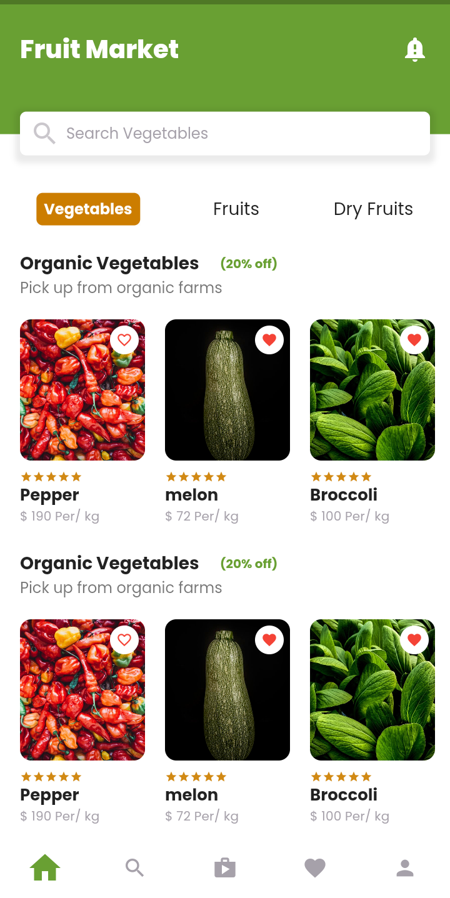
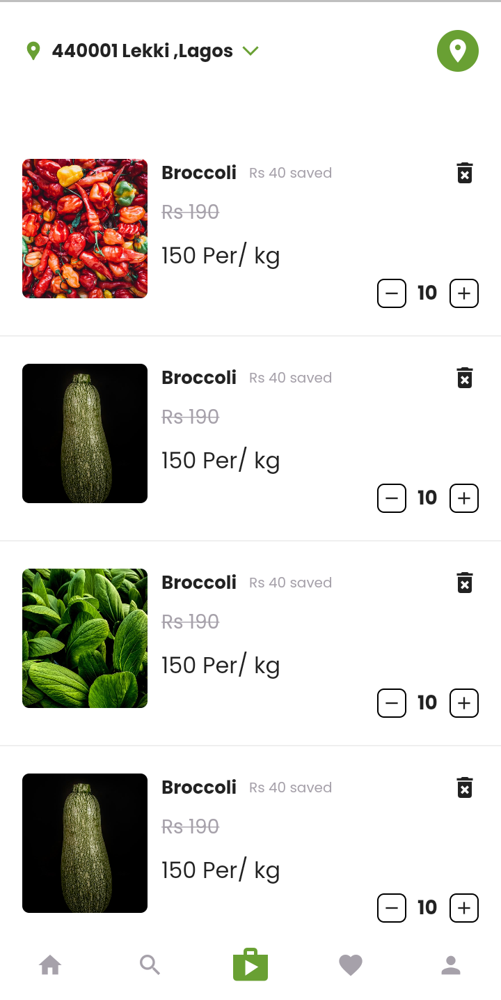
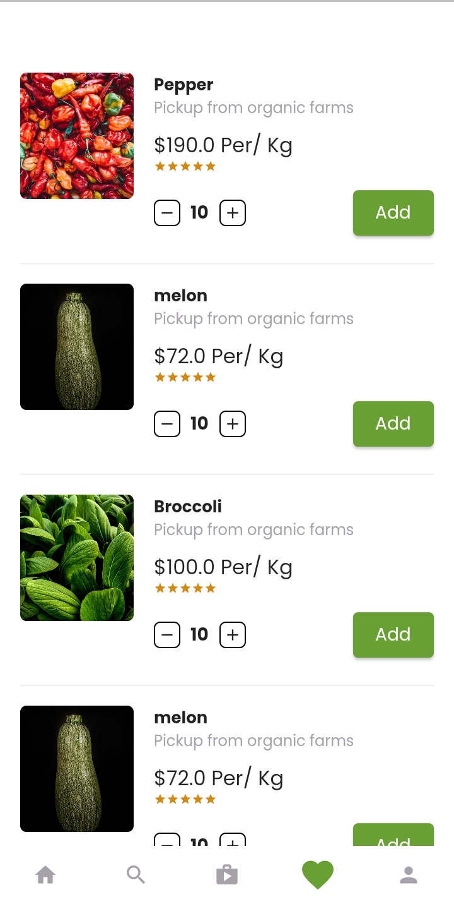
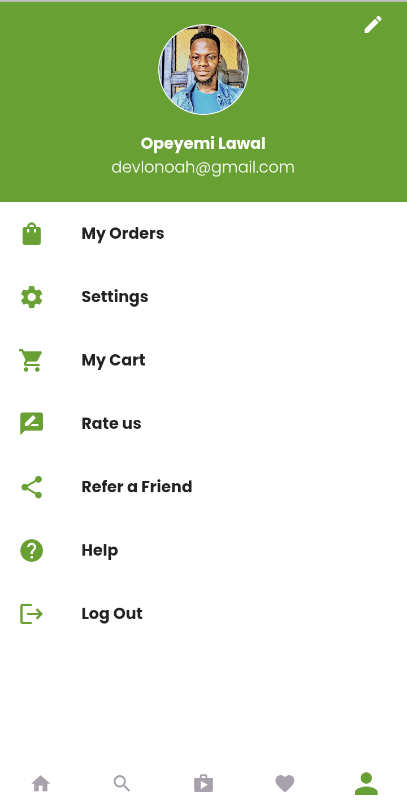

# Vegetable Market UI 🔥  

Simple Vegetable market
 
Star⭐ the repo if you like what you see😉

.

## ✨ Requirements

- Any Operating System (ie. MacOS X, Linux, Windows)
- Any IDE with SDK installed (ie. IntelliJ, Android Studio, VSCode etc)
- A little knowledge of Flutter and dart

## 📸 ScreenShots

  
  
  
 
 

## 🤓 Author(s)

**Opeyemi Lawal** 

<!-- ## 🔖 LICENCE

[WTFPL](http://www.wtfpl.net/about/) -->
